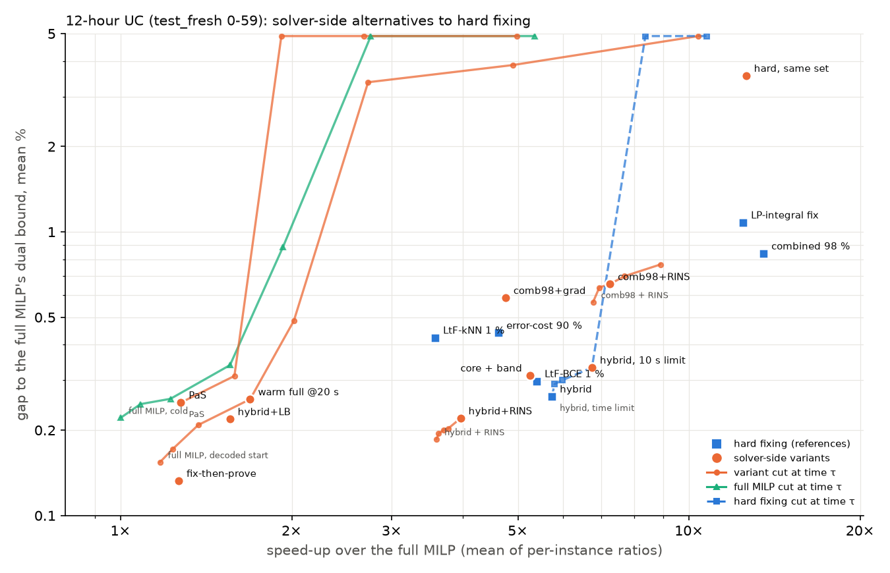

# 12-hour UC (test_fresh 0-59): solver-side alternatives to hard fixing

60 instances; gap = (C − DB) / C with DB the dual bound of the full MILP solved cold in the same process; speed-up = mean (median) of per-instance T_full / T_method over feasible instances; method time includes inference, the LP relaxation fed to the GNN, guards, decoding / start LPs and, for polish variants, the whole base pipeline. 95 % CIs: instance bootstrap.

Full MILP (cold, this process): mean 26.6 s, gap to its own bound 0.221 % (max 4.32 %).

Re-timing: the full MILP here takes 26.6 s on average against 25.2 s in the stored dataset run (median per-instance ratio 1.27; 13 % of instances within ±10 %; objectives agree to 3.725 %). All speed-ups below use the re-timed, paired full MILP.

## Hard-fixing references, re-run in the same process

| variant | feasible % | gap to DB mean % [95 % CI] | median % | max % | speed-up mean | median | ratio of mean times | time mean s | fixed % |
|---|---|---|---|---|---|---|---|---|---|
| faithful LtF, kNN, eps = 1 % (paper's setting) (`ref:ltf_knn`) | 100 | 0.424 [0.30, 0.58] | 0.243 | 3.59 | 3.58 | 1.66 | 1.44 | 18.4 | 68 |
| faithful LtF, BCE GNN, eps = 1 % (`ref:ltf_bce`) | 98 | 0.298 [0.19, 0.43] | 0.097 | 2.41 | 5.39 | 2.50 | 2.38 | 11.1 | 84 |
| hybrid (guard-aware LtF on error-cost scores, 360 val) (`ref:hybrid`) | 100 | 0.263 [0.19, 0.35] | 0.130 | 1.80 | 5.74 | 2.23 | 1.85 | 14.4 | 86 |
| ours: error-cost + adequacy guard, 90 % (`ref:ec90`) | 100 | 0.441 [0.25, 0.67] | 0.100 | 4.36 | 4.62 | 3.16 | 3.15 | 8.4 | 90 |
| ours: combined pipeline, 98 % (`ref:comb98`) | 100 | 0.840 [0.57, 1.15] | 0.342 | 6.28 | 13.52 | 7.94 | 7.54 | 3.5 | 92 |
| no learning: fix the LP-integral decisions (`lpfix`) | 100 | 1.080 [0.80, 1.39] | 0.814 | 6.74 | 12.44 | 10.04 | 10.09 | 2.6 | 98 |

## 1. Trust region (Predict-and-Search) vs hard fixing at the same k

| variant | feasible % | gap to DB mean % [95 % CI] | median % | max % | speed-up mean | median | ratio of mean times | time mean s | fixed % |
|---|---|---|---|---|---|---|---|---|---|
| Predict-and-Search, (q0, q1) = (0.97, 0.9), Delta = 10, 30 s limit (`pas:0.97:0.9:10:30`) | 100 | 0.250 [0.14, 0.39] | 0.094 | 3.03 | 1.28 | 1.16 | 1.32 | 20.1 | – |
| same set hard-fixed (`hard:0.97:0.9`) | 100 | 3.552 [1.19, 6.55] | 0.199 | 68.96 | 12.60 | 5.69 | 6.77 | 3.9 | 95 |
| hybrid fixings hard + trust region over the rest of the set, Delta = 10 (`core:hybrid:0.97:0.9:10`) | 100 | 0.312 [0.20, 0.45] | 0.128 | 3.22 | 5.25 | 2.23 | 1.89 | 14.1 | 86 |

## 2. Warm starts (to proof, and cut at the validation-chosen tau)

| variant | feasible % | gap to DB mean % [95 % CI] | median % | max % | speed-up mean | median | ratio of mean times | time mean s | fixed % |
|---|---|---|---|---|---|---|---|---|---|
| full MILP, decoded start, to proof (`warmfull:dec`) | 100 | 0.154 [0.08, 0.26] | 0.081 | 2.65 | 1.17 | 0.99 | 1.03 | 25.8 | – |
| full MILP, decoded start, cut at 20 s (`warmfull:dec`) @ τ = 20 s | 100 | 0.257 [0.13, 0.42] | 0.085 | 3.05 | 1.69 | 1.38 | 1.75 | 15.2 | – |
| full MILP, cold, cut at 20 s (`full`) @ τ = 20 s | 100 | 0.339 [0.15, 0.59] | 0.096 | 5.85 | 1.56 | 1.08 | 1.72 | 15.4 | – |
| hybrid reduced MILP, decoded start, to proof (`warmred:hybrid`) | 100 | 0.268 [0.19, 0.36] | 0.131 | 1.82 | 5.73 | 2.20 | 1.92 | 13.9 | 86 |
| hybrid reduced MILP, decoded start, cut at 10 s (`warmred:hybrid`) @ τ = 10 s | 100 | 0.478 [0.25, 0.84] | 0.145 | 9.45 | 6.74 | 3.99 | 4.32 | 6.2 | 86 |
| hybrid reduced MILP, cold, cut at 10 s (`ref:hybrid`) @ τ = 10 s | 100 | 0.333 [0.22, 0.47] | 0.145 | 3.15 | 6.75 | 3.94 | 4.33 | 6.1 | 86 |
| error-cost 90 % reduced MILP, decoded start, to proof (`warmred:ec90`) | 100 | 0.441 [0.26, 0.67] | 0.100 | 4.36 | 4.35 | 3.13 | 3.12 | 8.5 | 90 |
| error-cost 90 % reduced MILP, decoded start, cut at 10 s (`warmred:ec90`) @ τ = 10 s | 100 | 0.459 [0.27, 0.69] | 0.110 | 4.36 | 4.83 | 3.75 | 4.19 | 6.4 | 90 |
| error-cost 90 % reduced MILP, cold, cut at 10 s (`ref:ec90`) @ τ = 10 s | 100 | 0.450 [0.26, 0.68] | 0.102 | 4.36 | 5.05 | 3.80 | 4.18 | 6.4 | 90 |
| combined 98 % reduced MILP, decoded start, to proof (`warmred:comb98`) | 100 | 0.841 [0.57, 1.16] | 0.342 | 6.28 | 12.71 | 7.53 | 7.58 | 3.5 | 92 |
| fix, then prove: full MILP from the hybrid's solution (60 s) (`ftp:hybrid`) | 100 | 0.133 [0.08, 0.19] | 0.084 | 1.42 | 1.26 | 0.74 | 0.68 | 39.3 | – |

## 3. Fix and polish (headline tau chosen on validation)

| variant | feasible % | gap to DB mean % [95 % CI] | median % | max % | speed-up mean | median | ratio of mean times | time mean s | fixed % |
|---|---|---|---|---|---|---|---|---|---|
| hybrid + RINS, tau = 1 s (`rins:hybrid:10`) @ τ = 1 s | 100 | 0.220 [0.15, 0.30] | 0.104 | 1.80 | 3.96 | 1.99 | 1.76 | 15.1 | 98 |
| hybrid + local branching r = 10, tau = 10 s (`lb:hybrid:10:10`) @ τ = 10 s | 100 | 0.219 [0.15, 0.30] | 0.099 | 1.80 | 1.56 | 1.18 | 1.22 | 21.9 | – |
| combined 98 % + RINS, tau = 3 s (`rins:comb98:10`) @ τ = 3 s | 100 | 0.655 [0.46, 0.86] | 0.306 | 3.11 | 7.25 | 5.64 | 5.40 | 4.9 | 98 |
| combined 98 % + gradient release m = 60, tau = 10 s (`grad:comb98:60:10`) @ τ = 10 s | 100 | 0.585 [0.41, 0.78] | 0.289 | 2.61 | 4.76 | 3.29 | 3.43 | 7.8 | 85 |
| combined 98 % + local branching r = 10, tau = 10 s (`lb:comb98:10:10`) @ τ = 10 s | 100 | 0.680 [0.47, 0.92] | 0.277 | 4.28 | 2.44 | 2.11 | 2.39 | 11.2 | – |

## Paired differences (variant − comparator; gap in pp, log speed-up; instances feasible for both)

| variant | comparator | n | gap diff pp [95 % CI] | log speed-up diff [95 % CI] |
|---|---|---|---|---|
| faithful LtF, kNN, eps = 1 % (paper's setting) | `ref:hybrid` | 60 | +0.161 [+0.013, +0.333] | -0.40 [-0.70, -0.10] |
| faithful LtF, BCE GNN, eps = 1 % | `ref:hybrid` | 59 | +0.032 [-0.058, +0.147] | +0.10 [-0.13, +0.32] |
| faithful LtF, BCE GNN, eps = 1 % | `ref:ltf_knn` | 59 | -0.130 [-0.306, +0.023] | +0.53 [+0.27, +0.79] |
| hybrid (guard-aware LtF on error-cost scores, 360 val) | `ref:ltf_knn` | 60 | -0.161 [-0.333, -0.013] | +0.40 [+0.10, +0.70] |
| ours: error-cost + adequacy guard, 90 % | `ref:hybrid` | 60 | +0.178 [+0.022, +0.360] | +0.08 [-0.23, +0.39] |
| ours: error-cost + adequacy guard, 90 % | `ref:ltf_knn` | 60 | +0.017 [-0.209, +0.253] | +0.48 [+0.18, +0.78] |
| ours: combined pipeline, 98 % | `ref:hybrid` | 60 | +0.577 [+0.328, +0.868] | +0.99 [+0.65, +1.36] |
| ours: combined pipeline, 98 % | `ref:ltf_knn` | 60 | +0.416 [+0.139, +0.728] | +1.40 [+1.06, +1.73] |
| no learning: fix the LP-integral decisions | `ref:hybrid` | 60 | +0.817 [+0.546, +1.106] | +1.13 [+0.85, +1.42] |
| no learning: fix the LP-integral decisions | `ref:ltf_knn` | 60 | +0.656 [+0.388, +0.949] | +1.54 [+1.25, +1.81] |
| Predict-and-Search, (q0, q1) = (0.97, 0.9), Delta = 10, 30 s limit | `ref:hybrid` | 60 | -0.013 [-0.107, +0.099] | -1.00 [-1.28, -0.72] |
| Predict-and-Search, (q0, q1) = (0.97, 0.9), Delta = 10, 30 s limit | `ref:ltf_knn` | 60 | -0.174 [-0.352, -0.013] | -0.59 [-0.86, -0.34] |
| same set hard-fixed | `ref:hybrid` | 60 | +3.289 [+0.950, +6.265] | +0.88 [+0.50, +1.26] |
| same set hard-fixed | `ref:ltf_knn` | 60 | +3.129 [+0.783, +6.136] | +1.28 [+0.92, +1.62] |
| hybrid fixings hard + trust region over the rest of the set, Delta = 10 | `ref:hybrid` | 60 | +0.049 [+0.008, +0.108] | -0.04 [-0.15, +0.07] |
| hybrid fixings hard + trust region over the rest of the set, Delta = 10 | `ref:ltf_knn` | 60 | -0.112 [-0.294, +0.054] | +0.36 [+0.07, +0.65] |
| full MILP, decoded start, to proof | `ref:hybrid` | 60 | -0.109 [-0.176, -0.046] | -1.10 [-1.34, -0.85] |
| full MILP, decoded start, to proof | `ref:ltf_knn` | 60 | -0.270 [-0.441, -0.126] | -0.69 [-0.92, -0.48] |
| full MILP, decoded start, cut at 20 s | `ref:hybrid` | 60 | -0.006 [-0.110, +0.114] | -0.76 [-1.05, -0.47] |
| full MILP, decoded start, cut at 20 s | `ref:ltf_knn` | 60 | -0.167 [-0.363, +0.017] | -0.36 [-0.62, -0.11] |
| full MILP, cold, cut at 20 s | `ref:hybrid` | 60 | +0.076 [-0.094, +0.299] | -0.78 [-1.10, -0.46] |
| full MILP, cold, cut at 20 s | `ref:ltf_knn` | 60 | -0.085 [-0.306, +0.162] | -0.38 [-0.67, -0.10] |
| hybrid reduced MILP, decoded start, to proof | `ref:hybrid` | 60 | +0.005 [+0.001, +0.010] | +0.01 [-0.09, +0.11] |
| hybrid reduced MILP, decoded start, to proof | `ref:ltf_knn` | 60 | -0.156 [-0.328, -0.007] | +0.41 [+0.09, +0.72] |
| hybrid reduced MILP, decoded start, cut at 10 s | `ref:hybrid` | 60 | +0.215 [+0.026, +0.553] | +0.40 [+0.24, +0.57] |
| hybrid reduced MILP, decoded start, cut at 10 s | `ref:ltf_knn` | 60 | +0.054 [-0.236, +0.439] | +0.80 [+0.50, +1.08] |
| hybrid reduced MILP, cold, cut at 10 s | `ref:ltf_knn` | 60 | -0.091 [-0.283, +0.083] | +0.81 [+0.53, +1.08] |
| error-cost 90 % reduced MILP, decoded start, to proof | `ref:hybrid` | 60 | +0.178 [+0.022, +0.361] | +0.08 [-0.18, +0.36] |
| error-cost 90 % reduced MILP, decoded start, to proof | `ref:ltf_knn` | 60 | +0.017 [-0.210, +0.253] | +0.49 [+0.21, +0.75] |
| error-cost 90 % reduced MILP, decoded start, cut at 10 s | `ref:hybrid` | 60 | +0.196 [+0.041, +0.377] | +0.23 [-0.04, +0.50] |
| error-cost 90 % reduced MILP, decoded start, cut at 10 s | `ref:ltf_knn` | 60 | +0.035 [-0.193, +0.270] | +0.63 [+0.35, +0.89] |
| error-cost 90 % reduced MILP, cold, cut at 10 s | `ref:hybrid` | 60 | +0.187 [+0.032, +0.370] | +0.22 [-0.08, +0.52] |
| error-cost 90 % reduced MILP, cold, cut at 10 s | `ref:ltf_knn` | 60 | +0.026 [-0.197, +0.259] | +0.62 [+0.32, +0.91] |
| combined 98 % reduced MILP, decoded start, to proof | `ref:hybrid` | 60 | +0.578 [+0.330, +0.869] | +0.96 [+0.63, +1.32] |
| combined 98 % reduced MILP, decoded start, to proof | `ref:ltf_knn` | 60 | +0.417 [+0.141, +0.730] | +1.37 [+1.03, +1.69] |
| fix, then prove: full MILP from the hybrid's solution (60 s) | `ref:hybrid` | 60 | -0.130 [-0.189, -0.080] | -1.27 [-1.45, -1.09] |
| fix, then prove: full MILP from the hybrid's solution (60 s) | `ref:ltf_knn` | 60 | -0.291 [-0.452, -0.165] | -0.86 [-1.12, -0.61] |
| hybrid + RINS, tau = 1 s | `ref:hybrid` | 60 | -0.043 [-0.076, -0.015] | -0.19 [-0.25, -0.14] |
| hybrid + RINS, tau = 1 s | `ref:ltf_knn` | 60 | -0.204 [-0.370, -0.065] | +0.21 [-0.07, +0.48] |
| hybrid + local branching r = 10, tau = 10 s | `ref:hybrid` | 60 | -0.044 [-0.085, -0.016] | -0.87 [-1.07, -0.68] |
| hybrid + local branching r = 10, tau = 10 s | `ref:ltf_knn` | 60 | -0.205 [-0.368, -0.069] | -0.47 [-0.73, -0.22] |
| combined 98 % + RINS, tau = 3 s | `ref:hybrid` | 60 | +0.392 [+0.214, +0.584] | +0.56 [+0.27, +0.86] |
| combined 98 % + RINS, tau = 3 s | `ref:ltf_knn` | 60 | +0.231 [+0.029, +0.438] | +0.96 [+0.65, +1.26] |
| combined 98 % + gradient release m = 60, tau = 10 s | `ref:hybrid` | 60 | +0.322 [+0.149, +0.511] | +0.16 [-0.10, +0.44] |
| combined 98 % + gradient release m = 60, tau = 10 s | `ref:ltf_knn` | 60 | +0.161 [-0.040, +0.370] | +0.56 [+0.30, +0.82] |
| combined 98 % + local branching r = 10, tau = 10 s | `ref:hybrid` | 60 | +0.418 [+0.234, +0.623] | -0.42 [-0.72, -0.12] |
| combined 98 % + local branching r = 10, tau = 10 s | `ref:ltf_knn` | 60 | +0.257 [+0.030, +0.499] | -0.02 [-0.29, +0.24] |
| full MILP @20 s: decoded start vs cold | `full` @ 20 s | 60 | -0.082 [-0.210, +0.013] | +0.02 [-0.10, +0.13] |
| hybrid @10 s: decoded start vs cold | `ref:hybrid` @ 10 s | 60 | +0.145 [-0.030, +0.467] | -0.01 [-0.08, +0.07] |
| error-cost 90 % @10 s: decoded start vs cold | `ref:ec90` @ 10 s | 60 | +0.009 [-0.017, +0.038] | +0.01 [-0.09, +0.10] |
| PaS vs hard fixing of the same set | `hard:0.97:0.9` | 60 | -3.302 [-6.227, -1.000] | -1.87 [-2.08, -1.67] |
| core + band vs hybrid alone | `ref:hybrid` | 60 | +0.049 [+0.008, +0.108] | -0.04 [-0.15, +0.07] |
| comb98 + RINS @3 s vs error-cost 90 % | `ref:ec90` | 60 | +0.214 [+0.038, +0.387] | +0.47 [+0.28, +0.67] |
| comb98 + grad @10 s vs error-cost 90 % | `ref:ec90` | 60 | +0.145 [-0.071, +0.347] | +0.08 [-0.08, +0.24] |
| comb98 + RINS @3 s vs hybrid cut at 10 s | `ref:hybrid` @ 10 s | 60 | +0.322 [+0.154, +0.507] | +0.15 [-0.06, +0.36] |
| fix-then-prove vs cold full MILP | `full` | 60 | -0.088 [-0.228, -0.002] | -0.14 [-0.33, +0.07] |
| hybrid + RINS @1 s vs faithful LtF BCE | `ref:ltf_bce` | 59 | -0.076 [-0.186, +0.007] | -0.29 [-0.50, -0.08] |

## Warm start vs cold start (same instances)

| comparison | n | start accepted % | time to proof mean s cold / warm | median cold / warm | median ratio cold/warm [95 % CI of mean log ratio] | TTQ 1 %: reached % cold / warm, median s cold / warm | TTQ 0.5 %: reached %, median s |
|---|---|---|---|---|---|---|---|
| full MILP: decoded start vs cold | 60 | 100.0 | 26.6 / 25.8 | 21.6 / 17.8 | 0.99 [0.92, 1.17] | 100 / 100, 10.8 / 3.2 | 100 / 100, 11.0 / 9.7 |
| hybrid reduced MILP: decoded start vs cold | 60 | 100.0 | 14.4 / 13.9 | 6.0 / 6.2 | 0.92 [0.91, 1.12] | 98 / 98, 5.1 / 3.8 | 93 / 93, 5.2 / 5.4 |
| error-cost 90 % reduced MILP: decoded start vs cold | 60 | 100.0 | 8.4 / 8.5 | 6.2 / 5.9 | 0.97 [0.89, 1.13] | 90 / 90, 3.0 / 1.3 | 85 / 85, 3.3 / 2.9 |
| combined 98 % reduced MILP: decoded start vs cold | 60 | 100.0 | 3.5 / 3.5 | 2.0 / 1.9 | 0.94 [0.90, 1.04] | 73 / 73, 1.7 / 0.9 | 62 / 60, 1.7 / 1.1 |
| full MILP: hybrid solution as start (incl. the hybrid's time) vs cold | 60 | 100.0 | 26.6 / 39.3 | 21.6 / 36.9 | 0.74 [0.72, 1.07] | 100 / 100, 10.8 / 6.1 | 100 / 100, 11.0 / 6.3 |

## Polish: gap reduction against added time

| polish (base) | τ s | gap base → polished, mean % | Δ gap pp [95 % CI] | added time mean s | speed-up base → polished |
|---|---|---|---|---|---|
| hybrid + RINS **(selected on val)** | 1 | 0.263 → 0.220 | -0.043 [-0.076, -0.015] | 0.75 | 5.74 → 3.96 |
| hybrid + RINS | 2 | 0.263 → 0.203 | -0.060 [-0.106, -0.024] | 1.22 | 5.74 → 3.77 |
| hybrid + RINS | 3 | 0.263 → 0.200 | -0.063 [-0.109, -0.026] | 1.62 | 5.74 → 3.70 |
| hybrid + RINS | 5 | 0.263 → 0.195 | -0.068 [-0.114, -0.031] | 2.20 | 5.74 → 3.63 |
| hybrid + RINS | 10 | 0.263 → 0.186 | -0.077 [-0.124, -0.039] | 2.52 | 5.74 → 3.60 |
| hybrid + local branching r = 10 | 1 | 0.263 → 0.263 | -0.000 [-0.000, -0.000] | 1.02 | 5.74 → 3.32 |
| hybrid + local branching r = 10 | 2 | 0.263 → 0.239 | -0.024 [-0.061, -0.002] | 1.95 | 5.74 → 2.58 |
| hybrid + local branching r = 10 | 3 | 0.263 → 0.226 | -0.037 [-0.078, -0.010] | 2.72 | 5.74 → 2.25 |
| hybrid + local branching r = 10 | 5 | 0.263 → 0.222 | -0.041 [-0.081, -0.012] | 4.11 | 5.74 → 1.93 |
| hybrid + local branching r = 10 **(selected on val)** | 10 | 0.263 → 0.219 | -0.044 [-0.085, -0.016] | 7.52 | 5.74 → 1.56 |
| hybrid + full MILP from its solution | 1 | 0.263 → 0.263 | -0.000 [-0.000, -0.000] | 1.02 | 5.74 → 3.32 |
| hybrid + full MILP from its solution | 2 | 0.263 → 0.242 | -0.021 [-0.049, -0.000] | 1.95 | 5.74 → 2.59 |
| hybrid + full MILP from its solution | 3 | 0.263 → 0.240 | -0.023 [-0.051, -0.002] | 2.75 | 5.74 → 2.28 |
| hybrid + full MILP from its solution | 5 | 0.263 → 0.239 | -0.024 [-0.052, -0.003] | 4.19 | 5.74 → 2.00 |
| hybrid + full MILP from its solution | 10 | 0.263 → 0.211 | -0.052 [-0.087, -0.020] | 7.61 | 5.74 → 1.67 |
| hybrid + full MILP from its solution | 20 | 0.263 → 0.140 | -0.123 [-0.181, -0.074] | 13.06 | 5.74 → 1.45 |
| combined 98 % + RINS | 1 | 0.840 → 0.767 | -0.072 [-0.195, -0.003] | 0.67 | 13.52 → 8.90 |
| combined 98 % + RINS | 2 | 0.840 → 0.698 | -0.142 [-0.295, -0.030] | 1.10 | 13.52 → 7.70 |
| combined 98 % + RINS **(selected on val)** | 3 | 0.840 → 0.655 | -0.185 [-0.343, -0.062] | 1.40 | 13.52 → 7.25 |
| combined 98 % + RINS | 5 | 0.840 → 0.637 | -0.203 [-0.365, -0.079] | 1.74 | 13.52 → 6.95 |
| combined 98 % + RINS | 10 | 0.840 → 0.566 | -0.274 [-0.462, -0.119] | 2.15 | 13.52 → 6.78 |
| combined 98 % + gradient release m = 60 | 1 | 0.840 → 0.760 | -0.080 [-0.203, -0.011] | 0.91 | 13.52 → 8.12 |
| combined 98 % + gradient release m = 60 | 2 | 0.840 → 0.738 | -0.102 [-0.235, -0.019] | 1.42 | 13.52 → 6.80 |
| combined 98 % + gradient release m = 60 | 3 | 0.840 → 0.728 | -0.111 [-0.259, -0.022] | 1.91 | 13.52 → 6.09 |
| combined 98 % + gradient release m = 60 | 5 | 0.840 → 0.678 | -0.162 [-0.317, -0.057] | 2.76 | 13.52 → 5.35 |
| combined 98 % + gradient release m = 60 **(selected on val)** | 10 | 0.840 → 0.585 | -0.254 [-0.440, -0.109] | 4.24 | 13.52 → 4.76 |
| combined 98 % + local branching r = 10 | 1 | 0.840 → 0.840 | -0.000 [-0.000, -0.000] | 1.02 | 13.52 → 7.95 |
| combined 98 % + local branching r = 10 | 2 | 0.840 → 0.837 | -0.003 [-0.007, -0.000] | 1.95 | 13.52 → 5.85 |
| combined 98 % + local branching r = 10 | 3 | 0.840 → 0.746 | -0.094 [-0.236, -0.005] | 2.71 | 13.52 → 4.76 |
| combined 98 % + local branching r = 10 | 5 | 0.840 → 0.725 | -0.114 [-0.258, -0.010] | 4.14 | 13.52 → 3.62 |
| combined 98 % + local branching r = 10 | 10 | 0.840 → 0.680 | -0.159 [-0.319, -0.040] | 7.62 | 13.52 → 2.44 |

## Pareto front (mean gap vs mean speed-up)

| point | speed-up mean | gap mean % |
|---|---|---|
| combined 98 % | 13.52 | 0.840 |
| hard, same set | 12.60 | 3.552 |
| LP-integral fix | 12.44 | 1.080 |
| comb98+RINS | 7.25 | 0.655 |
| hybrid, 10 s limit | 6.75 | 0.333 |
| hybrid | 5.74 | 0.263 |
| LtF-BCE 1 % | 5.39 | 0.298 |
| core + band | 5.25 | 0.312 |
| comb98+grad | 4.76 | 0.585 |
| error-cost 90 % | 4.62 | 0.441 |
| hybrid+RINS | 3.96 | 0.220 |
| LtF-kNN 1 % | 3.58 | 0.424 |
| warm full @20 s | 1.69 | 0.257 |
| hybrid+LB | 1.56 | 0.219 |
| PaS | 1.28 | 0.250 |
| fix-then-prove | 1.26 | 0.133 |

