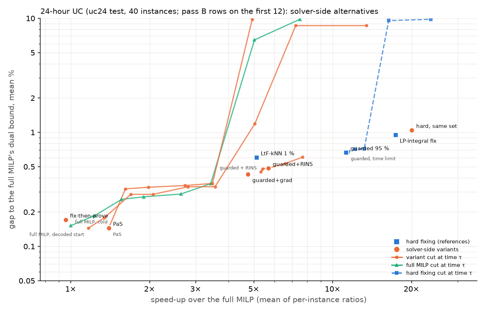

# 24-hour UC (uc24 test, 40 instances; pass B rows on the first 12): solver-side alternatives

40 instances; gap = (C − DB) / C with DB the dual bound of the full MILP solved cold in the same process; speed-up = mean (median) of per-instance T_full / T_method over feasible instances; method time includes inference, the LP relaxation fed to the GNN, guards, decoding / start LPs and, for polish variants, the whole base pipeline. 95 % CIs: instance bootstrap.

Full MILP (cold, this process): mean 149.6 s, gap to its own bound 0.152 % (max 0.78 %).

Re-timing: the full MILP here takes 149.6 s on average against 154.3 s in the stored dataset run (median per-instance ratio 0.98; 80 % of instances within ±10 %; objectives agree to 0.045 %). All speed-ups below use the re-timed, paired full MILP.

## Hard-fixing references, re-run in the same process

| variant | n | feasible % | gap to DB mean % [95 % CI] | median % | max % | speed-up mean | median | ratio of mean times | time mean s | fixed % |
|---|---|---|---|---|---|---|---|---|---|---|
| faithful LtF, kNN, eps = 1 % (paper's setting) (`ref:ltf_knn`) | 40 | 100 | 0.603 [0.41, 0.82] | 0.281 | 2.70 | 5.12 | 3.29 | 2.76 | 54.3 | 67 |
| ours: guarded rule, 95 % target (`ref:g95`) | 40 | 100 | 0.668 [0.49, 0.86] | 0.454 | 2.29 | 11.25 | 4.13 | 4.91 | 30.5 | 85 |
| no learning: fix the LP-integral decisions (`lpfix`) | 40 | 100 | 0.951 [0.70, 1.22] | 0.706 | 3.35 | 17.36 | 8.87 | 10.10 | 14.8 | 98 |

## 1. Trust region (first 12 instances)

| variant | n | feasible % | gap to DB mean % [95 % CI] | median % | max % | speed-up mean | median | ratio of mean times | time mean s | fixed % |
|---|---|---|---|---|---|---|---|---|---|---|
| Predict-and-Search, (q0, q1) = (0.97, 0.9), Delta = 20, 150 s limit (`pas:0.97:0.9:20:150`) | 12 | 100 | 0.145 [0.07, 0.23] | 0.102 | 0.49 | 1.40 | 1.09 | 1.63 | 95.4 | – |
| same set hard-fixed (`hard:0.97:0.9`) | 12 | 100 | 1.047 [0.62, 1.53] | 0.711 | 2.58 | 20.06 | 3.72 | 3.60 | 43.3 | 86 |

## 2. Warm starts

| variant | n | feasible % | gap to DB mean % [95 % CI] | median % | max % | speed-up mean | median | ratio of mean times | time mean s | fixed % |
|---|---|---|---|---|---|---|---|---|---|---|
| guarded 95 % reduced MILP, decoded start, to proof (`warmred:g95`) | 40 | 100 | 0.671 [0.49, 0.86] | 0.480 | 2.29 | 11.28 | 5.29 | 4.67 | 32.0 | 85 |
| full MILP, decoded start, to proof (first 12) (`warmfull:dec`) | 12 | 100 | 0.144 [0.06, 0.24] | 0.090 | 0.44 | 1.17 | 1.09 | 1.14 | 136.4 | – |
| fix, then prove: full MILP from the guarded rule's solution (first 12) (`ftp:g95`) | 12 | 100 | 0.171 [0.06, 0.29] | 0.080 | 0.59 | 0.96 | 0.82 | 0.79 | 196.6 | – |

## 3. Fix and polish (headline tau chosen on validation)

| variant | n | feasible % | gap to DB mean % [95 % CI] | median % | max % | speed-up mean | median | ratio of mean times | time mean s | fixed % |
|---|---|---|---|---|---|---|---|---|---|---|
| guarded 95 % + RINS, tau = 20 s (`rins:g95:60`) @ τ = 20 s | 40 | 100 | 0.486 [0.35, 0.64] | 0.346 | 1.79 | 5.68 | 3.00 | 3.58 | 41.8 | 97 |
| guarded 95 % + gradient release m = 250, tau = 60 s (`grad:g95:250:60`) @ τ = 60 s | 40 | 100 | 0.430 [0.31, 0.57] | 0.340 | 2.12 | 4.75 | 2.57 | 2.68 | 55.8 | 74 |

## Paired differences (variant − comparator; gap in pp, log speed-up; instances feasible for both)

| variant | comparator | n | gap diff pp [95 % CI] | log speed-up diff [95 % CI] |
|---|---|---|---|---|
| faithful LtF, kNN, eps = 1 % (paper's setting) | `ref:g95` | 40 | -0.065 [-0.263, +0.134] | -0.67 [-1.08, -0.25] |
| ours: guarded rule, 95 % target | `ref:ltf_knn` | 40 | +0.065 [-0.134, +0.263] | +0.67 [+0.25, +1.08] |
| no learning: fix the LP-integral decisions | `ref:g95` | 40 | +0.283 [+0.064, +0.530] | +0.50 [+0.15, +0.87] |
| no learning: fix the LP-integral decisions | `ref:ltf_knn` | 40 | +0.348 [+0.119, +0.568] | +1.17 [+0.80, +1.52] |
| Predict-and-Search, (q0, q1) = (0.97, 0.9), Delta = 20, 150 s limit | `ref:g95` | 12 | -0.745 [-1.074, -0.433] | -1.43 [-2.12, -0.79] |
| Predict-and-Search, (q0, q1) = (0.97, 0.9), Delta = 20, 150 s limit | `ref:ltf_knn` | 12 | -0.544 [-0.918, -0.236] | -1.21 [-1.92, -0.57] |
| same set hard-fixed | `ref:g95` | 12 | +0.157 [+0.022, +0.326] | +0.10 [-0.32, +0.60] |
| same set hard-fixed | `ref:ltf_knn` | 12 | +0.359 [-0.078, +0.809] | +0.32 [-0.74, +1.37] |
| guarded 95 % reduced MILP, decoded start, to proof | `ref:g95` | 40 | +0.003 [-0.000, +0.008] | -0.00 [-0.16, +0.15] |
| guarded 95 % reduced MILP, decoded start, to proof | `ref:ltf_knn` | 40 | +0.068 [-0.131, +0.267] | +0.66 [+0.28, +1.04] |
| full MILP, decoded start, to proof (first 12) | `ref:g95` | 12 | -0.745 [-1.060, -0.450] | -1.57 [-2.33, -0.88] |
| full MILP, decoded start, to proof (first 12) | `ref:ltf_knn` | 12 | -0.544 [-0.916, -0.236] | -1.36 [-1.95, -0.80] |
| fix, then prove: full MILP from the guarded rule's solution (first 12) | `ref:g95` | 12 | -0.718 [-1.039, -0.422] | -1.84 [-2.50, -1.24] |
| fix, then prove: full MILP from the guarded rule's solution (first 12) | `ref:ltf_knn` | 12 | -0.517 [-0.877, -0.217] | -1.62 [-2.15, -1.09] |
| guarded 95 % + RINS, tau = 20 s | `ref:g95` | 40 | -0.182 [-0.291, -0.092] | -0.52 [-0.69, -0.37] |
| guarded 95 % + RINS, tau = 20 s | `ref:ltf_knn` | 40 | -0.117 [-0.307, +0.067] | +0.15 [-0.18, +0.47] |
| guarded 95 % + gradient release m = 250, tau = 60 s | `ref:g95` | 40 | -0.238 [-0.345, -0.141] | -0.69 [-0.85, -0.55] |
| guarded 95 % + gradient release m = 250, tau = 60 s | `ref:ltf_knn` | 40 | -0.173 [-0.382, +0.019] | -0.02 [-0.36, +0.30] |
| PaS vs hard fixing of the same set | `hard:0.97:0.9` | 12 | -0.902 [-1.353, -0.506] | -1.53 [-2.35, -0.80] |
| fix-then-prove vs cold full MILP | `full` | 12 | -0.023 [-0.060, +0.003] | -0.12 [-0.33, +0.10] |
| guarded + RINS @20 s vs LtF-kNN | `ref:ltf_knn` | 40 | -0.117 [-0.307, +0.067] | +0.15 [-0.18, +0.47] |

## Warm start vs cold start (same instances)

| comparison | n | start accepted % | time to proof mean s cold / warm | median cold / warm | median ratio cold/warm [95 % CI of mean log ratio] | TTQ 1 %: reached % cold / warm, median s cold / warm | TTQ 0.5 %: reached %, median s |
|---|---|---|---|---|---|---|---|
| full MILP: decoded start vs cold (first 12) | 12 | 100.0 | 155.9 / 136.4 | 128.3 / 118.6 | 1.09 [1.04, 1.28] | 100 / 100, 24.4 / 23.2 | 100 / 100, 26.5 / 24.1 |
| guarded 95 % reduced MILP: decoded start vs cold | 40 | 100.0 | 30.5 / 32.0 | 13.1 / 13.5 | 0.93 [0.85, 1.17] | 80 / 80, 10.3 / 8.5 | 57 / 57, 11.2 / 10.8 |
| full MILP: guarded rule's solution as start (incl. its time) vs cold (first 12) | 12 | 100.0 | 155.9 / 196.6 | 128.3 / 166.8 | 0.82 [0.72, 1.11] | 100 / 100, 24.4 / 33.5 | 100 / 100, 26.5 / 33.5 |

## Polish: gap reduction against added time

| polish (base) | n | τ s | gap base → polished, mean % | Δ gap pp [95 % CI] | added time mean s | speed-up base → polished |
|---|---|---|---|---|---|---|
| guarded 95 % + RINS | 40 | 5 | 0.668 → 0.606 | -0.062 [-0.116, -0.018] | 3.88 | 11.25 → 7.67 |
| guarded 95 % + RINS | 40 | 10 | 0.668 → 0.533 | -0.134 [-0.209, -0.068] | 7.00 | 11.25 → 6.60 |
| guarded 95 % + RINS **(selected on val)** | 40 | 20 | 0.668 → 0.486 | -0.182 [-0.291, -0.092] | 11.29 | 11.25 → 5.68 |
| guarded 95 % + RINS | 40 | 30 | 0.668 → 0.478 | -0.189 [-0.298, -0.098] | 13.64 | 11.25 → 5.40 |
| guarded 95 % + RINS | 40 | 60 | 0.668 → 0.453 | -0.215 [-0.342, -0.112] | 15.16 | 11.25 → 5.32 |
| guarded 95 % + gradient release m = 250 | 40 | 5 | 0.668 → 0.663 | -0.005 [-0.012, -0.000] | 4.22 | 11.25 → 7.26 |
| guarded 95 % + gradient release m = 250 | 40 | 10 | 0.668 → 0.633 | -0.034 [-0.086, -0.004] | 7.55 | 11.25 → 6.18 |
| guarded 95 % + gradient release m = 250 | 40 | 20 | 0.668 → 0.488 | -0.180 [-0.276, -0.096] | 12.61 | 11.25 → 5.40 |
| guarded 95 % + gradient release m = 250 | 40 | 30 | 0.668 → 0.452 | -0.216 [-0.316, -0.127] | 16.91 | 11.25 → 5.06 |
| guarded 95 % + gradient release m = 250 **(selected on val)** | 40 | 60 | 0.668 → 0.430 | -0.238 [-0.345, -0.141] | 25.34 | 11.25 → 4.75 |
| guarded 95 % + full MILP from its solution (first 12) | 12 | 10 | 0.890 → 0.885 | -0.004 [-0.013, -0.000] | 8.33 | 12.22 → 5.11 |
| guarded 95 % + full MILP from its solution (first 12) | 12 | 20 | 0.890 → 0.801 | -0.089 [-0.228, -0.000] | 17.29 | 12.22 → 3.52 |
| guarded 95 % + full MILP from its solution (first 12) | 12 | 30 | 0.890 → 0.539 | -0.351 [-0.614, -0.126] | 24.36 | 12.22 → 2.80 |
| guarded 95 % + full MILP from its solution (first 12) | 12 | 60 | 0.890 → 0.287 | -0.602 [-0.940, -0.297] | 43.22 | 12.22 → 1.89 |
| guarded 95 % + full MILP from its solution (first 12) | 12 | 120 | 0.890 → 0.248 | -0.642 [-0.977, -0.340] | 78.22 | 12.22 → 1.30 |

## Pareto front (mean gap vs mean speed-up)

| point | speed-up mean | gap mean % |
|---|---|---|
| hard, same set | 20.06 | 1.047 |
| LP-integral fix | 17.36 | 0.951 |
| guarded 95 % | 11.25 | 0.668 |
| guarded+RINS | 5.68 | 0.486 |
| LtF-kNN 1 % | 5.12 | 0.603 |
| guarded+grad | 4.75 | 0.430 |
| PaS | 1.40 | 0.145 |
| fix-then-prove | 0.96 | 0.171 |

